# AdventureWorks 


## Database Schema

The database is defined by [install.sql](./install.sql) and consists of **68 tables** across
**5 schemas** (`Person`, `HumanResources`, `Production`, `Purchasing`, `Sales`), linked by
**90 foreign keys**. Row counts below are line counts of the corresponding raw, headerless CSV
in [data/](./data) (one row per line); column counts reflect the table's final shape after the
schema's own `ALTER TABLE ... DROP COLUMN` statements run in `install.sql`. `data/` also
contains `*.PX.csv` / `*.NDX.csv` files, which are precomputed primary/secondary index files
used to speed up loading — not database tables — and are excluded from the counts below, along
with the superseded staging files `ProductModelorg.csv` and `JobCandidate_TOREMOVE.csv`.

### Tables

### Table Kind Legend

| Kind        |  # | PK | FK | Meaning                                                                                              |
| ----------- | ---| ---| ---| ------------------------------------------------------------------------------------------------------ |
| Lookup      | 31 | ID | -  | Static Reference/controlled-vocabulary entity; Rows are relatively stable and usually referenced by other entities. surrogate or natural key.                |
| Primary     | 31 | ID |    | Independent master entity; owns its own identity and surrogate or natural key.                |
| Subtype     |  6 | ParentID | ParentID | 1:1 extension row whose primary key is also a foreign key to its supertype (e.g. `Employee` extends `Person`). |
| Detail      | 11 | ParentID + Pos  | ParentID | Structural or line-item child row (order lines, cart items, hierarchy members) tied to one parent.        |
| History     |  8 | ParentID + Date | ParentID | Temporal/versioned or append-only log row tracking how a parent's data changed over time.                |
| Linking     | 12 | FK1, FK2...     | FK1, FK2... | N:M junction table; only a composite unique key to two (or more) other tables.               |
| Association | 12 | FK1, FK2...     | FK1, FK2... | N:M table with additional Columns.               |
| Link-Entity | 12 | ID2 | FK1, FK2... | N:M table plus a Primary key referenced by other tables and additional Columns.               |
| Total       | 68 |  |  |  | |


### Table Dependency Flow Diagram

Arrows point from the table holding the foreign key to the table it references, labeled with
the referencing column(s). Intra-schema references are drawn inside each schema's subgraph;
cross-schema references are drawn below.

```mermaid
flowchart LR
  subgraph PersonSchema["Person"]
    BusinessEntity["BusinessEntity"]
    Person["Person"]
    StateProvince["StateProvince"]
    Address["Address"]
    AddressType["AddressType"]
    BusinessEntityAddress["BusinessEntityAddress"]
    ContactType["ContactType"]
    BusinessEntityContact["BusinessEntityContact"]
    EmailAddress["EmailAddress"]
    Password["Password"]
    PhoneNumberType["PhoneNumberType"]
    PersonPhone["PersonPhone"]
    CountryRegion["CountryRegion"]

    Address -->|StateProvinceID| StateProvince
    BusinessEntityAddress -->|AddressID| Address
    BusinessEntityAddress -->|AddressTypeID| AddressType
    BusinessEntityAddress -->|BusinessEntityID| BusinessEntity
    BusinessEntityContact -->|PersonID| Person
    linkStyle 4 stroke-width:1px

    BusinessEntityContact -->|ContactTypeID| ContactType
    BusinessEntityContact -->|BusinessEntityID| BusinessEntity
    EmailAddress -->|BusinessEntityID| Person
    Password -->|BusinessEntityID| Person
    Person -->|BusinessEntityID| BusinessEntity
    linkStyle 9 stroke-width:1px

    PersonPhone -->|BusinessEntityID| Person
    PersonPhone -->|PhoneNumberTypeID| PhoneNumberType
    StateProvince -->|CountryRegionCode| CountryRegion
  end

  subgraph HumanResources
    Department["Department"]
    Employee["Employee"]
    EmployeeDepartmentHistory["EmployeeDepartmentHistory"]
    EmployeePayHistory["EmployeePayHistory"]
    JobCandidate["JobCandidate"]
    Shift["Shift"]

    EmployeeDepartmentHistory -->|DepartmentID| Department
    EmployeeDepartmentHistory -->|BusinessEntityID| Employee
    linkStyle 14 stroke-width:1px

    EmployeeDepartmentHistory -->|ShiftID| Shift
    EmployeePayHistory -->|BusinessEntityID| Employee
    JobCandidate -->|BusinessEntityID| Employee
  end

  subgraph Production
    BillOfMaterials["BillOfMaterials"]
    Culture["Culture"]
    Document["Document"]
    ProductCategory["ProductCategory"]
    ProductSubcategory["ProductSubcategory"]
    ProductModel["ProductModel"]
    Product["Product"]
    ProductCostHistory["ProductCostHistory"]
    ProductDescription["ProductDescription"]
    ProductDocument["ProductDocument"]
    Location["Location"]
    ProductInventory["ProductInventory"]
    ProductListPriceHistory["ProductListPriceHistory"]
    Illustration["Illustration"]
    ProductModelIllustration["ProductModelIllustration"]
    ProductModelProductDescriptionCulture["ProductModelProductDescriptionCulture"]
    ProductPhoto["ProductPhoto"]
    ProductProductPhoto["ProductProductPhoto"]
    ProductReview["ProductReview"]
    ScrapReason["ScrapReason"]
    TransactionHistory["TransactionHistory"]
    TransactionHistoryArchive["TransactionHistoryArchive"]
    UnitMeasure["UnitMeasure"]
    WorkOrder["WorkOrder"]
    WorkOrderRouting["WorkOrderRouting"]

    BillOfMaterials -->|ProductAssemblyID| Product
    BillOfMaterials -->|ComponentID| Product
    linkStyle 19 stroke-width:1px

    BillOfMaterials -->|UnitMeasureCode| UnitMeasure
    Product -->|SizeUnitMeasureCode| UnitMeasure
    Product -->|WeightUnitMeasureCode| UnitMeasure
    Product -->|ProductModelID| ProductModel
    Product -->|ProductSubcategoryID| ProductSubcategory
    linkStyle 24 stroke-width:1px

    ProductCostHistory -->|ProductID| Product
    ProductDocument -->|ProductID| Product
    ProductDocument -->|Doc| Document
    ProductInventory -->|LocationID| Location
    ProductInventory -->|ProductID| Product
    linkStyle 29 stroke-width:1px

    ProductListPriceHistory -->|ProductID| Product
    ProductModelIllustration -->|ProductModelID| ProductModel
    ProductModelIllustration -->|IllustrationID| Illustration
    ProductModelProductDescriptionCulture -->|ProductDescriptionID| ProductDescription
    ProductModelProductDescriptionCulture -->|CultureID| Culture
    linkStyle 34 stroke-width:1px

    ProductModelProductDescriptionCulture -->|ProductModelID| ProductModel
    ProductProductPhoto -->|ProductID| Product
    ProductProductPhoto -->|ProductPhotoID| ProductPhoto
    ProductReview -->|ProductID| Product
    ProductSubcategory -->|ProductCategoryID| ProductCategory
    linkStyle 39 stroke-width:1px

    TransactionHistory -->|ProductID| Product
    WorkOrder -->|ProductID| Product
    WorkOrder -->|ScrapReasonID| ScrapReason
    WorkOrderRouting -->|LocationID| Location
    WorkOrderRouting -->|WorkOrderID| WorkOrder
    linkStyle 44 stroke-width:1px
  end

  subgraph Purchasing
    ProductVendor["ProductVendor"]
    PurchaseOrderDetail["PurchaseOrderDetail"]
    PurchaseOrderHeader["PurchaseOrderHeader"]
    ShipMethod["ShipMethod"]
    Vendor["Vendor"]

    ProductVendor -->|BusinessEntityID| Vendor
    PurchaseOrderDetail -->|PurchaseOrderID| PurchaseOrderHeader
    PurchaseOrderHeader -->|VendorID| Vendor
    PurchaseOrderHeader -->|ShipMethodID| ShipMethod
  end

  subgraph Sales
    CountryRegionCurrency["CountryRegionCurrency"]
    CreditCard["CreditCard"]
    Currency["Currency"]
    CurrencyRate["CurrencyRate"]
    Customer["Customer"]
    PersonCreditCard["PersonCreditCard"]
    SalesOrderDetail["SalesOrderDetail"]
    SalesOrderHeader["SalesOrderHeader"]
    SalesOrderHeaderSalesReason["SalesOrderHeaderSalesReason"]
    SalesPerson["SalesPerson"]
    SalesPersonQuotaHistory["SalesPersonQuotaHistory"]
    SalesReason["SalesReason"]
    SalesTaxRate["SalesTaxRate"]
    SalesTerritory["SalesTerritory"]
    SalesTerritoryHistory["SalesTerritoryHistory"]
    ShoppingCartItem["ShoppingCartItem"]
    SpecialOffer["SpecialOffer"]
    SpecialOfferProduct["SpecialOfferProduct"]
    Store["Store"]

    CountryRegionCurrency -->|CurrencyCode| Currency
    CurrencyRate -->|FromCurrencyCode| Currency
    CurrencyRate -->|ToCurrencyCode| Currency
    Customer -->|StoreID| Store
    Customer -->|TerritoryID| SalesTerritory
    linkStyle 54 stroke-width:1px

    PersonCreditCard -->|CreditCardID| CreditCard
    SalesOrderDetail -->|SalesOrderID| SalesOrderHeader
    SalesOrderDetail -->|SpecialOfferID_ProductID| SpecialOfferProduct
    SalesOrderHeader -->|CreditCardID| CreditCard
    SalesOrderHeader -->|CurrencyRateID| CurrencyRate
    linkStyle 59 stroke-width:1px

    SalesOrderHeader -->|CustomerID| Customer
    SalesOrderHeader -->|SalesPersonID| SalesPerson
    SalesOrderHeader -->|TerritoryID| SalesTerritory
    SalesOrderHeaderSalesReason -->|SalesReasonID| SalesReason
    SalesOrderHeaderSalesReason -->|SalesOrderID| SalesOrderHeader
    linkStyle 64 stroke-width:1px

    SalesPerson -->|TerritoryID| SalesTerritory
    SalesPersonQuotaHistory -->|BusinessEntityID| SalesPerson
    SalesTerritoryHistory -->|BusinessEntityID| SalesPerson
    SalesTerritoryHistory -->|TerritoryID| SalesTerritory
    SpecialOfferProduct -->|SpecialOfferID| SpecialOffer
    linkStyle 69 stroke-width:1px

    Store -->|SalesPersonID| SalesPerson
  end

  %% Cross-schema references
  CountryRegionCurrency -->|CountryRegionCode| CountryRegion
  Customer -->|PersonID| Person
  Document -->|Owner| Employee
  Employee -->|BusinessEntityID| Person
  PersonCreditCard -->|BusinessEntityID| Person
  linkStyle 74 stroke-width:1px

  ProductVendor -->|ProductID| Product
  ProductVendor -->|UnitMeasureCode| UnitMeasure
  PurchaseOrderDetail -->|ProductID| Product
  PurchaseOrderHeader -->|EmployeeID| Employee
  SalesOrderHeader -->|BillToAddressID| Address
  linkStyle 79 stroke-width:1px

  SalesOrderHeader -->|ShipToAddressID| Address
  SalesOrderHeader -->|ShipMethodID| ShipMethod
  SalesPerson -->|BusinessEntityID| Employee
  SalesTaxRate -->|StateProvinceID| StateProvince
  SalesTerritory -->|CountryRegionCode| CountryRegion
  linkStyle 84 stroke-width:1px

  ShoppingCartItem -->|ProductID| Product
  SpecialOfferProduct -->|ProductID| Product
  StateProvince -->|TerritoryID| SalesTerritory
  Store -->|BusinessEntityID| BusinessEntity
  Vendor -->|BusinessEntityID| BusinessEntity
  linkStyle 89 stroke-width:1px
```

### Entity-Relationship Diagram

Only primary-key (`PK`) and foreign-key (`FK`) columns are shown per entity; see the
[Tables](#tables) section above for full column counts, and `install.sql` for complete column
definitions. Relationship labels name the referencing foreign-key column(s).

```mermaid
erDiagram 
    direction RL

    %% --- Person ---
    BusinessEntity {
        int BusinessEntityID PK
    }
    Person {
        int BusinessEntityID PK
    }
    StateProvince {
        int StateProvinceID PK
        varchar CountryRegionCode FK
        int TerritoryID FK
    }
    Address {
        int AddressID PK
        int StateProvinceID FK
    }
    AddressType {
        int AddressTypeID PK
    }
    BusinessEntityAddress {
        int BusinessEntityID PK,FK
        int AddressID PK,FK
        int AddressTypeID PK,FK
    }
    ContactType {
        int ContactTypeID PK
    }
    BusinessEntityContact {
        int BusinessEntityID PK,FK
        int PersonID PK,FK
        int ContactTypeID PK,FK
    }
    EmailAddress {
        int BusinessEntityID PK,FK
        int EmailAddressID PK
    }
    Password {
        int BusinessEntityID PK,FK
    }
    PhoneNumberType {
        int PhoneNumberTypeID PK
    }
    PersonPhone {
        int BusinessEntityID PK,FK
        varchar PhoneNumber PK
        int PhoneNumberTypeID PK,FK
    }
    CountryRegion {
        varchar CountryRegionCode PK
    }

    %% --- HumanResources ---
    Department {
        int DepartmentID PK
    }
    Employee {
        int BusinessEntityID PK,FK
    }
    EmployeeDepartmentHistory {
        int BusinessEntityID PK,FK
        int DepartmentID PK,FK
        int ShiftID PK,FK
        timestamp StartDate PK
    }
    EmployeePayHistory {
        int BusinessEntityID PK,FK
        timestamp RateChangeDate PK
    }
    JobCandidate {
        int JobCandidateID PK
        int BusinessEntityID FK
    }
    Shift {
        int ShiftID PK
    }

    %% --- Production ---
    BillOfMaterials {
        int BillOfMaterialsID PK
        int ProductAssemblyID FK
        int ComponentID FK
        varchar UnitMeasureCode FK
    }
    Culture {
        varchar CultureID PK
    }
    Document {
        varchar Doc PK
        int Owner FK
    }
    ProductCategory {
        int ProductCategoryID PK
    }
    ProductSubcategory {
        int ProductSubcategoryID PK
        int ProductCategoryID FK
    }
    ProductModel {
        int ProductModelID PK
    }
    Product {
        int ProductID PK
        varchar SizeUnitMeasureCode FK
        varchar WeightUnitMeasureCode FK
        int ProductModelID FK
        int ProductSubcategoryID FK
    }
    ProductCostHistory {
        int ProductID PK,FK
        timestamp StartDate PK
    }
    ProductDescription {
        int ProductDescriptionID PK
    }
    ProductDocument {
        int ProductID PK,FK
        varchar Doc PK,FK
    }
    Location {
        int LocationID PK
    }
    ProductInventory {
        int ProductID PK,FK
        int LocationID PK,FK
    }
    ProductListPriceHistory {
        int ProductID PK,FK
        timestamp StartDate PK
    }
    Illustration {
        int IllustrationID PK
    }
    ProductModelIllustration {
        int ProductModelID PK,FK
        int IllustrationID PK,FK
    }
    ProductModelProductDescriptionCulture {
        int ProductModelID PK,FK
        int ProductDescriptionID PK,FK
        varchar CultureID PK,FK
    }
    ProductPhoto {
        int ProductPhotoID PK
    }
    ProductProductPhoto {
        int ProductID PK,FK
        int ProductPhotoID PK,FK
    }
    ProductReview {
        int ProductReviewID PK
        int ProductID FK
    }
    ScrapReason {
        int ScrapReasonID PK
    }
    TransactionHistory {
        int TransactionID PK
        int ProductID FK
    }
    TransactionHistoryArchive {
        int TransactionID PK
    }
    UnitMeasure {
        varchar UnitMeasureCode PK
    }
    WorkOrder {
        int WorkOrderID PK
        int ProductID FK
        int ScrapReasonID FK
    }
    WorkOrderRouting {
        int WorkOrderID PK,FK
        int ProductID PK
        int OperationSequence PK
        int LocationID FK
    }

    %% --- Purchasing ---
    ProductVendor {
        int ProductID PK,FK
        int BusinessEntityID PK,FK
        varchar UnitMeasureCode FK
    }
    PurchaseOrderDetail {
        int PurchaseOrderDetailID PK
        int ProductID FK
        int PurchaseOrderID FK
    }
    PurchaseOrderHeader {
        int PurchaseOrderID PK
        int EmployeeID FK
        int VendorID FK
        int ShipMethodID FK
    }
    ShipMethod {
        int ShipMethodID PK
    }
    Vendor {
        int BusinessEntityID PK,FK
    }

    %% --- Sales ---
    CountryRegionCurrency {
        varchar CountryRegionCode PK,FK
        varchar CurrencyCode PK,FK
    }
    CreditCard {
        int CreditCardID PK
    }
    Currency {
        varchar CurrencyCode PK
    }
    CurrencyRate {
        int CurrencyRateID PK
        varchar FromCurrencyCode FK
        varchar ToCurrencyCode FK
    }
    Customer {
        int CustomerID PK
        int PersonID FK
        int StoreID FK
        int TerritoryID FK
    }
    PersonCreditCard {
        int BusinessEntityID PK,FK
        int CreditCardID PK,FK
    }
    SalesOrderDetail {
        int SalesOrderDetailID PK
        int SalesOrderID FK
        int SpecialOfferID FK
        int ProductID FK
    }
    SalesOrderHeader {
        int SalesOrderID PK
        int CustomerID FK
        int SalesPersonID FK
        int TerritoryID FK
        int BillToAddressID FK
        int ShipToAddressID FK
        int ShipMethodID FK
        int CreditCardID FK
        int CurrencyRateID FK
    }
    SalesOrderHeaderSalesReason {
        int SalesOrderID PK,FK
        int SalesReasonID PK,FK
    }
    SalesPerson {
        int BusinessEntityID PK,FK
        int TerritoryID FK
    }
    SalesPersonQuotaHistory {
        int BusinessEntityID PK,FK
        timestamp QuotaDate PK
    }
    SalesReason {
        int SalesReasonID PK
    }
    SalesTaxRate {
        int SalesTaxRateID PK
        int StateProvinceID FK
    }
    SalesTerritory {
        int TerritoryID PK
        varchar CountryRegionCode FK
    }
    SalesTerritoryHistory {
        int BusinessEntityID PK,FK
        int TerritoryID PK,FK
        timestamp StartDate PK
    }
    ShoppingCartItem {
        int ShoppingCartItemID PK
        int ProductID FK
    }
    SpecialOffer {
        int SpecialOfferID PK
    }
    SpecialOfferProduct {
        int SpecialOfferID PK,FK
        int ProductID PK,FK
    }
    Store {
        int BusinessEntityID PK,FK
        int SalesPersonID FK
    }

    %% --- Relationships (label = referencing FK column) ---
    StateProvince ||--o{ Address : "StateProvinceID"
    BusinessEntity ||--o{ Person : "BusinessEntityID"
    CountryRegion ||--o{ StateProvince : "CountryRegionCode"
    SalesTerritory ||--o{ StateProvince : "TerritoryID"
    Address ||--o{ BusinessEntityAddress : "AddressID"
    AddressType ||--o{ BusinessEntityAddress : "AddressTypeID"
    BusinessEntity ||--o{ BusinessEntityAddress : "BusinessEntityID"
    Person ||--o{ BusinessEntityContact : "PersonID"
    ContactType ||--o{ BusinessEntityContact : "ContactTypeID"
    BusinessEntity ||--o{ BusinessEntityContact : "BusinessEntityID"
    Person ||--o{ EmailAddress : "BusinessEntityID"
    Person ||--|| Password : "BusinessEntityID"
    Person ||--o{ PersonPhone : "BusinessEntityID"
    PhoneNumberType ||--o{ PersonPhone : "PhoneNumberTypeID"

    Person ||--|| Employee : "BusinessEntityID"
    Department ||--o{ EmployeeDepartmentHistory : "DepartmentID"
    Employee ||--o{ EmployeeDepartmentHistory : "BusinessEntityID"
    Shift ||--o{ EmployeeDepartmentHistory : "ShiftID"
    Employee ||--o{ EmployeePayHistory : "BusinessEntityID"
    Employee ||--o{ JobCandidate : "BusinessEntityID"

    Product ||--o{ BillOfMaterials : "ProductAssemblyID"
    Product ||--o{ BillOfMaterials : "ComponentID"
    UnitMeasure ||--o{ BillOfMaterials : "UnitMeasureCode"
    Employee ||--o{ Document : "Owner"
    ProductCategory ||--o{ ProductSubcategory : "ProductCategoryID"
    UnitMeasure ||--o{ Product : "SizeUnitMeasureCode"
    UnitMeasure ||--o{ Product : "WeightUnitMeasureCode"
    ProductModel ||--o{ Product : "ProductModelID"
    ProductSubcategory ||--o{ Product : "ProductSubcategoryID"
    Product ||--o{ ProductCostHistory : "ProductID"
    Product ||--o{ ProductDocument : "ProductID"
    Document ||--o{ ProductDocument : "Doc"
    Location ||--o{ ProductInventory : "LocationID"
    Product ||--o{ ProductInventory : "ProductID"
    Product ||--o{ ProductListPriceHistory : "ProductID"
    ProductModel ||--o{ ProductModelIllustration : "ProductModelID"
    Illustration ||--o{ ProductModelIllustration : "IllustrationID"
    ProductDescription ||--o{ ProductModelProductDescriptionCulture : "ProductDescriptionID"
    Culture ||--o{ ProductModelProductDescriptionCulture : "CultureID"
    ProductModel ||--o{ ProductModelProductDescriptionCulture : "ProductModelID"
    Product ||--o{ ProductProductPhoto : "ProductID"
    ProductPhoto ||--o{ ProductProductPhoto : "ProductPhotoID"
    Product ||--o{ ProductReview : "ProductID"
    Product ||--o{ TransactionHistory : "ProductID"
    Product ||--o{ WorkOrder : "ProductID"
    ScrapReason ||--o{ WorkOrder : "ScrapReasonID"
    Location ||--o{ WorkOrderRouting : "LocationID"
    WorkOrder ||--o{ WorkOrderRouting : "WorkOrderID"

    Product ||--o{ ProductVendor : "ProductID"
    UnitMeasure ||--o{ ProductVendor : "UnitMeasureCode"
    Vendor ||--o{ ProductVendor : "BusinessEntityID"
    Product ||--o{ PurchaseOrderDetail : "ProductID"
    PurchaseOrderHeader ||--o{ PurchaseOrderDetail : "PurchaseOrderID"
    Employee ||--o{ PurchaseOrderHeader : "EmployeeID"
    Vendor ||--o{ PurchaseOrderHeader : "VendorID"
    ShipMethod ||--o{ PurchaseOrderHeader : "ShipMethodID"
    BusinessEntity ||--|| Vendor : "BusinessEntityID"

    CountryRegion ||--o{ CountryRegionCurrency : "CountryRegionCode"
    Currency ||--o{ CountryRegionCurrency : "CurrencyCode"
    Currency ||--o{ CurrencyRate : "FromCurrencyCode"
    Currency ||--o{ CurrencyRate : "ToCurrencyCode"
    Person ||--o{ Customer : "PersonID"
    Store ||--o{ Customer : "StoreID"
    SalesTerritory ||--o{ Customer : "TerritoryID"
    Person ||--o{ PersonCreditCard : "BusinessEntityID"
    CreditCard ||--o{ PersonCreditCard : "CreditCardID"
    SalesOrderHeader ||--o{ SalesOrderDetail : "SalesOrderID"
    SpecialOfferProduct ||--o{ SalesOrderDetail : "SpecialOfferID_ProductID"
    Address ||--o{ SalesOrderHeader : "BillToAddressID"
    Address ||--o{ SalesOrderHeader : "ShipToAddressID"
    CreditCard ||--o{ SalesOrderHeader : "CreditCardID"
    CurrencyRate ||--o{ SalesOrderHeader : "CurrencyRateID"
    Customer ||--o{ SalesOrderHeader : "CustomerID"
    SalesPerson ||--o{ SalesOrderHeader : "SalesPersonID"
    ShipMethod ||--o{ SalesOrderHeader : "ShipMethodID"
    SalesTerritory ||--o{ SalesOrderHeader : "TerritoryID"
    SalesReason ||--o{ SalesOrderHeaderSalesReason : "SalesReasonID"
    SalesOrderHeader ||--o{ SalesOrderHeaderSalesReason : "SalesOrderID"
    Employee ||--|| SalesPerson : "BusinessEntityID"
    SalesTerritory ||--o{ SalesPerson : "TerritoryID"
    SalesPerson ||--o{ SalesPersonQuotaHistory : "BusinessEntityID"
    StateProvince ||--o{ SalesTaxRate : "StateProvinceID"
    CountryRegion ||--o{ SalesTerritory : "CountryRegionCode"
    SalesPerson ||--o{ SalesTerritoryHistory : "BusinessEntityID"
    SalesTerritory ||--o{ SalesTerritoryHistory : "TerritoryID"
    Product ||--o{ ShoppingCartItem : "ProductID"
    Product ||--o{ SpecialOfferProduct : "ProductID"
    SpecialOffer ||--o{ SpecialOfferProduct : "SpecialOfferID"
    BusinessEntity ||--|| Store : "BusinessEntityID"
    SalesPerson ||--o{ Store : "SalesPersonID"
```

## Per-Schema Diagrams

Below, each schema's tables and intra-schema foreign keys are diagrammed in isolation. Tables
belonging to a different schema are shown as dashed "external" nodes/entities so the schema's
inbound and outbound cross-schema references stay visible without pulling in that schema's full
internal structure — see the [combined diagrams](#table-dependency-flow-diagram) above for the
whole picture at once.

### Schema: Person (13 tables)

| Table                  | Kind    | Rows [#] | Columns [#] | Primary Key                                        | Foreign Keys                                          |
| ----------------------- | ------- | -------: | ----------: | --------------------------------------------------- | ----------------------------------------------------- |
| BusinessEntity          | Primary |   20,780 |           3 | BusinessEntityID                                     |                                                       |
| Person                  | Subtype |   19,978 |          13 | BusinessEntityID (= BusinessEntity)                  | BusinessEntity                                        |
| StateProvince           | Primary |      187 |           8 | StateProvinceID                                      | SalesTerritory                                        |
| Address                 | Primary |   19,620 |           9 | AddressID                                            | StateProvince                                         |
| AddressType             | Primary |        9 |           4 | AddressTypeID                                        |                                                       |
| BusinessEntityAddress    | Linking |   19,615 |           5 | BusinessEntityID, AddressID, AddressTypeID           | BusinessEntity, Address, AddressType                  |
| ContactType             | Primary |       23 |           3 | ContactTypeID                                        |                                                       |
| BusinessEntityContact    | Linking |      910 |           5 | BusinessEntityID, PersonID, ContactTypeID            | BusinessEntity, Person, ContactType                   |
| EmailAddress            | Detail  |   19,973 |           5 | BusinessEntityID, EmailAddressID                      | Person                                                |
| Password                | Subtype |   19,978 |           5 | BusinessEntityID (= Person)                          | Person                                                |
| PhoneNumberType         | Primary |        6 |           3 | PhoneNumberTypeID                                    |                                                       |
| PersonPhone             | Linking |   19,973 |           4 | BusinessEntityID, PhoneNumber, PhoneNumberTypeID     | Person, PhoneNumberType                               |
| CountryRegion           | Primary |      241 |           3 | CountryRegionCode                                    |                                                       |

##### Person Flow Diagram

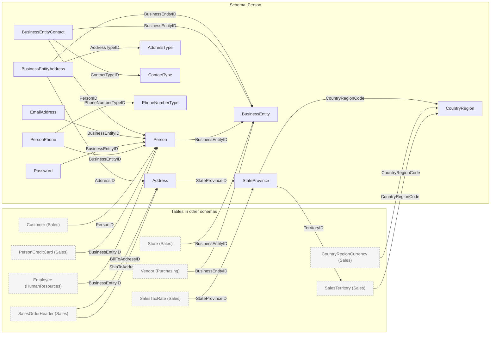

##### Person Entity-Relationship Diagram

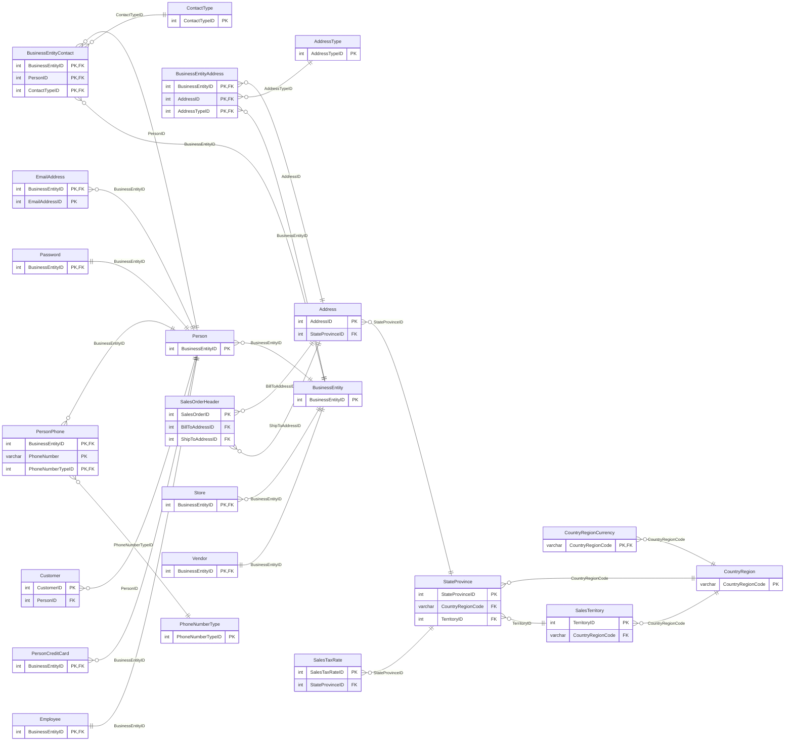

### Schema: HumanResources (6 tables)

| Table                        | Kind    | Rows [#] | Columns [#] | Primary Key                                       | Foreign Keys                           |
| ------------------------------ | ------- | -------: | ----------: | --------------------------------------------------- | -------------------------------------- |
| Department                    | Primary |       19 |           4 | DepartmentID                                         |                                        |
| Employee                      | Subtype |      296 |          15 | BusinessEntityID (= Person)                          | Person                                 |
| EmployeeDepartmentHistory      | History |      297 |           6 | BusinessEntityID, DepartmentID, ShiftID, StartDate   | Employee, Department, Shift            |
| EmployeePayHistory             | History |      317 |           5 | BusinessEntityID, RateChangeDate                     | Employee                               |
| JobCandidate                   | Detail  |       19 |           4 | JobCandidateID                                       | Employee                               |
| Shift                          | Primary |        6 |           5 | ShiftID                                              |                                        |

##### HumanResources Flow Diagram

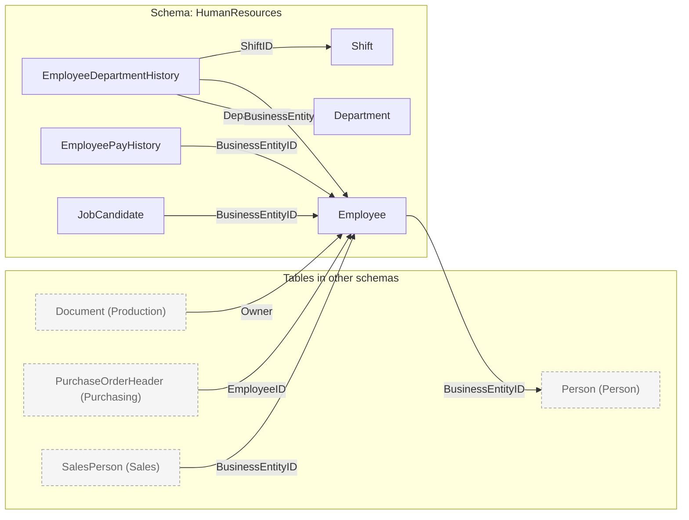

##### HumanResources Entity-Relationship Diagram

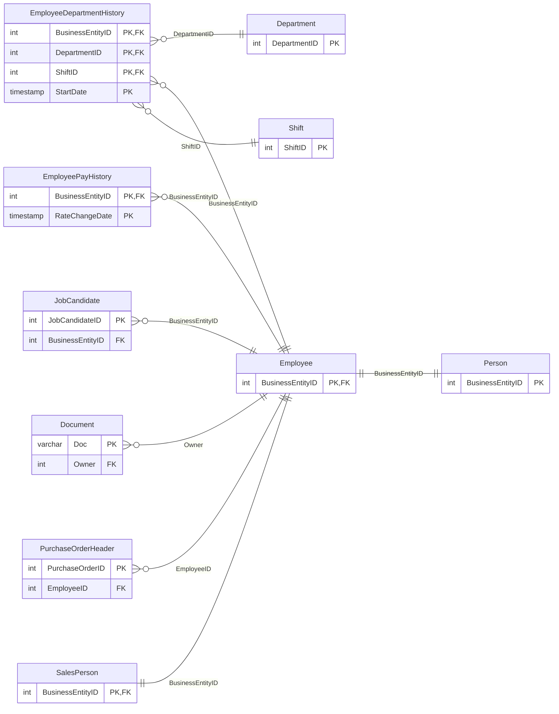

#### Schema: Production (25 tables)

| Table                                    | Kind    | Rows [#] | Columns [#] | Primary Key                                    | Foreign Keys                                                   |
| ------------------------------------------- | ------- | -------: | ----------: | ------------------------------------------------ | -------------------------------------------------------------- |
| BillOfMaterials                             | Detail  |    2,685 |           9 | BillOfMaterialsID                                 | ProductAssemblyID: Product, ComponentID: Product, UnitMeasure  |
| Culture                                     | Primary |       11 |           3 | CultureID                                        |                                                                |
| Document                                    | Primary |       17 |          14 | Doc / rowguid                                    |                                                                |
| ProductCategory                             | Primary |        7 |           4 | ProductCategoryID                                |                                                                |
| ProductSubcategory                          | Detail  |       43 |           5 | ProductSubcategoryID                             | ProductCategory                                                |
| ProductModel                                | Primary |      132 |           6 | ProductModelID                                   |                                                                |
| Product                                     | Primary |      510 |          25 | ProductID                                        | ProductModel, ProductSubcategory, SizeUnitMeasureCode: UnitMeasure, WeightUnitMeasureCode: UnitMeasure |
| ProductCostHistory                          | History |      396 |           5 | ProductID, StartDate                             | Product                                                        |
| ProductDescription                          | Primary |      765 |           4 | ProductDescriptionID                              |                                                                |
| ProductDocument                             | Linking |       33 |           3 | ProductID, Doc                                   | Product, Document                                              |
| Location                                    | Primary |       17 |           5 | LocationID                                       |                                                                |
| ProductInventory                            | Detail  |    1,070 |           7 | ProductID, LocationID                            | Product, Location                                              |
| ProductListPriceHistory                     | History |      396 |           5 | ProductID, StartDate                             | Product                                                        |
| Illustration                                | Primary |        8 |           3 | IllustrationID                                    |                                                                |
| ProductModelIllustration                    | Linking |        8 |           3 | ProductModelID, IllustrationID                   | ProductModel, Illustration                                     |
| ProductModelProductDescriptionCulture       | Linking |      763 |           4 | ProductModelID, ProductDescriptionID, CultureID  | ProductModel, ProductDescription, Culture                      |
| ProductPhoto                                | Primary |      104 |           6 | ProductPhotoID                                    |                                                                |
| ProductProductPhoto                         | Linking |      505 |           4 | ProductID, ProductPhotoID                        | Product, ProductPhoto                                          |
| ProductReview                               | Detail  |       10 |           8 | ProductReviewID                                   | Product                                                        |
| ScrapReason                                 | Primary |       19 |           3 | ScrapReasonID                                     |                                                                |
| TransactionHistory                          | History |  113,449 |           9 | TransactionID                                     | Product                                                        |
| TransactionHistoryArchive                   | History |   89,256 |           9 | TransactionID                                     | Product                                                        |
| UnitMeasure                                 | Primary |       41 |           3 | UnitMeasureCode                                   |                                                                |
| WorkOrder                                   | Primary |   72,597 |          10 | WorkOrderID                                       | Product, ScrapReason                                           |
| WorkOrderRouting                            | Detail  |   67,132 |          12 | WorkOrderID, ProductID, OperationSequence        | WorkOrder, Product, Location                                   |

#### Production Flow Diagram

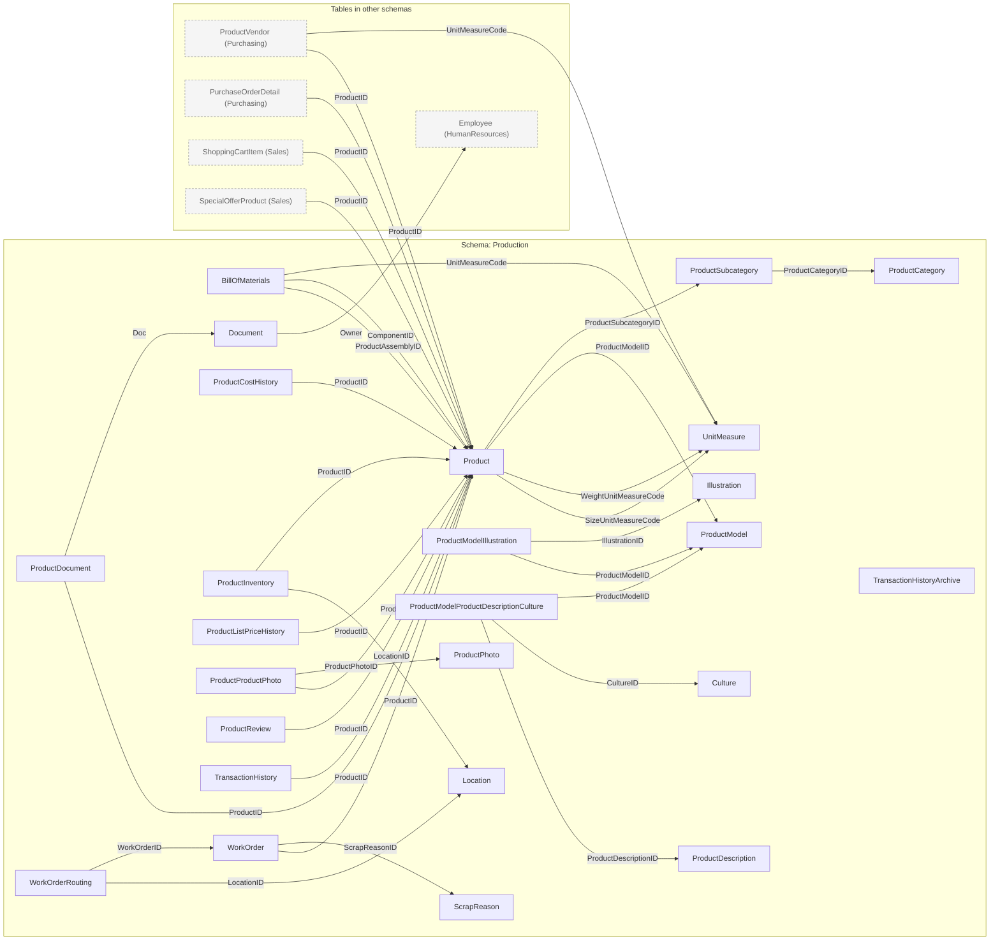

#### Production Entity-Relationship Diagram

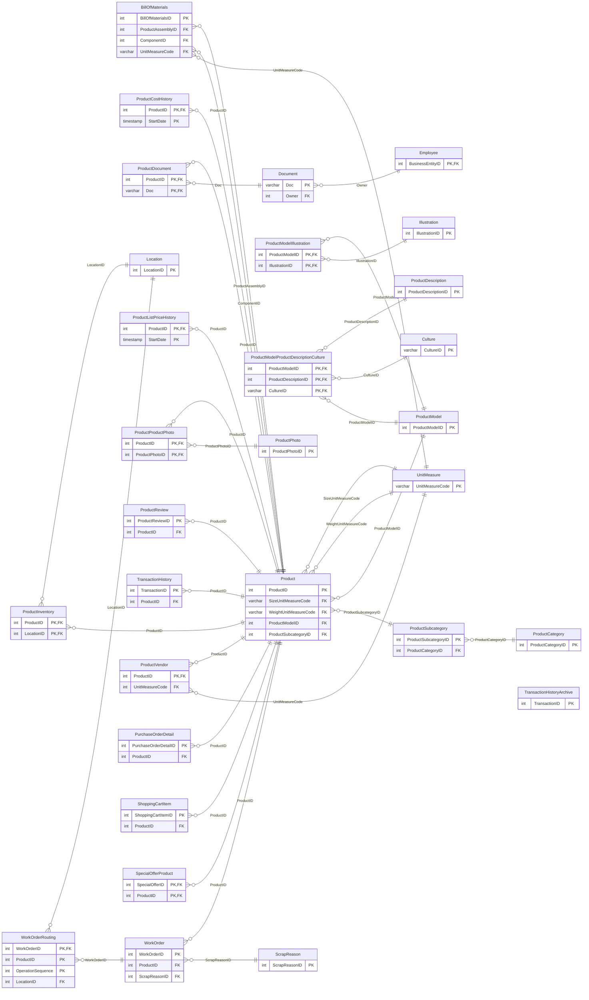

### Schema: Purchasing (5 tables)

| Table                | Kind    | Rows [#] | Columns [#] | Primary Key                        | Foreign Keys                              |
| ---------------------- | ------- | -------: | ----------: | ------------------------------------ | ----------------------------------------- |
| ProductVendor          | Linking |      461 |          11 | ProductID, BusinessEntityID          | Vendor, Product, UnitMeasure              |
| PurchaseOrderDetail    | Detail  |    8,846 |           9 | PurchaseOrderDetailID                | PurchaseOrderHeader, Product              |
| PurchaseOrderHeader    | Primary |    4,018 |          12 | PurchaseOrderID                      | Vendor, ShipMethod, Employee              |
| ShipMethod             | Primary |        8 |           6 | ShipMethodID                         |                                           |
| Vendor                 | Subtype |      110 |           8 | BusinessEntityID (= BusinessEntity)  | BusinessEntity                            |


#### Purchasing Flow Diagram

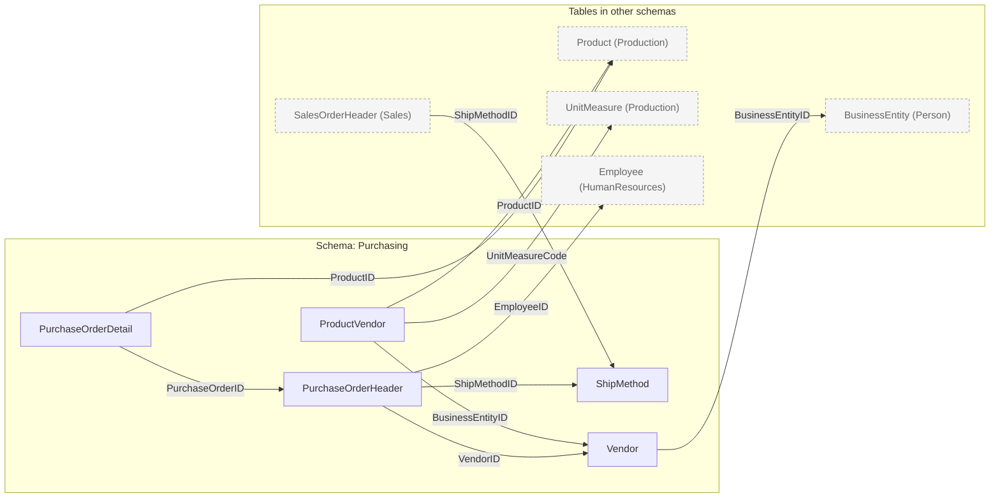

#### Purchasing Entity-Relationship Diagram

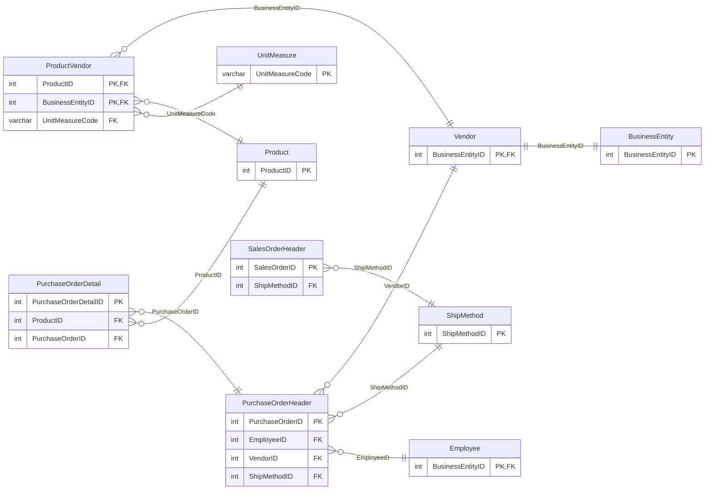

### Schema: Sales (19 tables)

| Table                          | Kind    | Rows [#] | Columns [#] | Primary Key                            | Foreign Keys                                                          |
| --------------------------------- | ------- | -------: | ----------: | ----------------------------------------- | --------------------------------------------------------------------- |
| CountryRegionCurrency              | Linking |      110 |           3 | CountryRegionCode, CurrencyCode           | CountryRegion, Currency                                               |
| CreditCard                        | Primary |   19,121 |           6 | CreditCardID                              |                                                                       |
| Currency                          | Primary |      108 |           3 | CurrencyCode                              |                                                                       |
| CurrencyRate                      | Primary |   13,538 |           7 | CurrencyRateID                            | FromCurrencyCode: Currency, ToCurrencyCode: Currency                  |
| Customer                          | Primary |   19,826 |           6 | CustomerID                                | Person, Store, SalesTerritory                                         |
| PersonCreditCard                  | Linking |   19,119 |           3 | BusinessEntityID, CreditCardID            | Person, CreditCard                                                    |
| SalesOrderDetail                  | Detail  |  121,318 |          10 | SalesOrderID, SalesOrderDetailID          | SalesOrderHeader, SpecialOfferProduct                                 |
| SalesOrderHeader                  | Primary |   31,471 |          25 | SalesOrderID                              | Customer, SalesPerson, BillToAddressID: Address, ShipToAddressID: Address, ShipMethod, CreditCard, CurrencyRate |
| SalesOrderHeaderSalesReason        | Linking |   27,648 |           3 | SalesOrderID, SalesReasonID               | SalesOrderHeader, SalesReason                                         |
| SalesPerson                       | Subtype |       23 |           9 | BusinessEntityID (= Employee)             | Employee                                                              |
| SalesPersonQuotaHistory           | History |      164 |           5 | BusinessEntityID, QuotaDate               | SalesPerson, SalesTerritory                                           |
| SalesReason                       | Primary |       13 |           4 | SalesReasonID                             |                                                                       |
| SalesTaxRate                      | Detail  |       35 |           7 | SalesTaxRateID                            | StateProvince                                                         |
| SalesTerritory                    | Primary |       16 |          10 | TerritoryID                               | CountryRegion                                                         |
| SalesTerritoryHistory             | History |       18 |           6 | BusinessEntityID, TerritoryID, StartDate  | SalesPerson, SalesTerritory                                           |
| ShoppingCartItem                  | Detail  |        9 |           6 | ShoppingCartItemID                        | Product                                                               |
| SpecialOffer                      | Primary |       19 |          11 | SpecialOfferID                            |                                                                       |
| SpecialOfferProduct                | Linking |      539 |           4 | SpecialOfferID, ProductID                 | SpecialOffer, Product                                                 |
| Store                             | Subtype |      707 |           6 | BusinessEntityID (= BusinessEntity)       | BusinessEntity, SalesPerson                                           |

#### Sales Flow Diagram

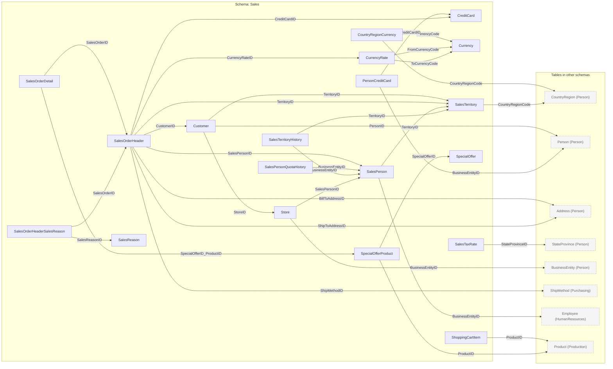

#### SalesEntity-Relationship Diagram

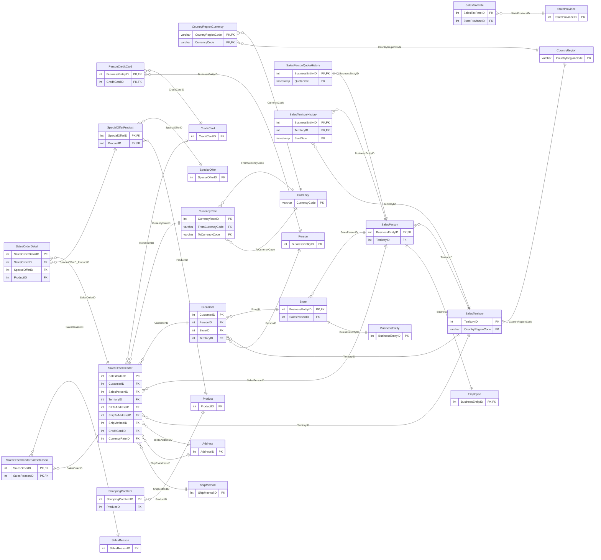

## Import to Postgres

This is based off the work done by [lorint](https://github.com/lorint/AdventureWorks-for-Postgres) and [josibake](https://github.com/NorfolkDataSci/adventure-works-postgres/) with minor script changes to fix relative paths and updated docs for remote server installation (in this case, an AWS RDS cluster). The included csv's have been converted already to be compatible with postgres. If you would like the original files, head over to [Adventure Works 2014 OLTP](https://msftdbprodsamples.codeplex.com/downloads/get/880662) download page. The download includes a script for loading the data into MSSQL Server.

This is the *non-DW* version of the database, meaning it has been normalized (Production.Product (normalized) vs Product (non-normalized)). It is the online, live, transactional version of the DB, which hasn't been DW (data warehoused) to be more coherent for analytic purposes. This is intentional to give the student more experience dealing with complex joins to get information.

The [raw csv files](./data) are contained in this repo should you want to port to a different database entirely. They **do not** contain column headers.
The [raw tsv files](./tsvs) are contained in this repo should you want to port to a different database entirely. They do not include all tables (WIP), however **do** contain column headers. This is useful for programs with flat file import (python, Qlik, Tableau, etc.).

## Getting started

Clone this repo in its entirety to your local machine. You will need [psql](https://www.postgresql.org/download/) installed on the machine on which you run this script. The instructions below will send the csvs through the network to the target DB. This is NOT written to commit the files to a local DB.

### Run the script

Once you have confirmed your postgres install, log into the server:

	$ psql -h myserver.mydomain.com -U myusername -d postgres
	Password for user myusername: 
	psql.bin (10.3, server 10.1)
	SSL connection (protocol: TLSv1.2, cipher: ECDHE-RSA-AES256-GCM-SHA384, bits: 256, compression: off)
	
	Type "help" for help.
	Cannot read termcap database;
	using dumb terminal settings.

Create the database:

	postgres=> CREATE DATABASE adventureworks;

Log out:

	postgres=>\q

*Important Note!* It appears there is a dependency on `postgresql-contrib-9.4` (or 9.5, etc, depending on version). If it is not run, the following failure will be experienced:

	$ psql -d adventureworks -f install.sql 
	Tuples only is on.
	psql:install.sql:53: ERROR:  could not open extension control file "/usr/share/pgsql94/extension/uuid-ossp.control": No such file or directory
	psql:install.sql:56: ERROR:  could not open extension control file "/usr/share/pgsql94/extension/tablefunc.control": No such file or directory
	CREATE DOMAIN
	CREATE DOMAIN
	CREATE DOMAIN
	CREATE DOMAIN
	CREATE DOMAIN
	CREATE DOMAIN
	psql:install.sql:173: ERROR:  function uuid_generate_v1() does not exist
	HINT:  No function matches the given name and argument types. You might need to add explicit type casts.
	psql:install.sql:175: ERROR:  schema "person" does not exist
	 Copying data into Person.BusinessEntity
	psql:install.sql:178: ERROR:  schema "person" does not exist
	 Copying data into Person.Person

Be sure this is installed _prior_ to running the step below (`-f install.sql`). To ensure it is installed you can perform the following:

  - Ubuntu:
	`sudo apt-get install postgresql-contrib-9.4`

  - RHEL:
	`yum install -y postgresql94-contrib`

Run the script from your local machine:

	$ psql -h myserver.mydomain.com -U myusername -d adventureworks -f install.sql

You should see something like the following while it processes:

	COPY 19972
	Copying data into Person.CountryRegion
	
	COPY 238
	CREATE SCHEMA
	COMMENT
	 Copying data into HumanResources.Department
	
	COPY 16
	 Copying data into HumanResources.Employee
	
	COPY 290
	Copying data into HumanResources.EmployeeDepartmentHistory

When completed, the import should look as follows:

